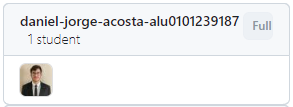
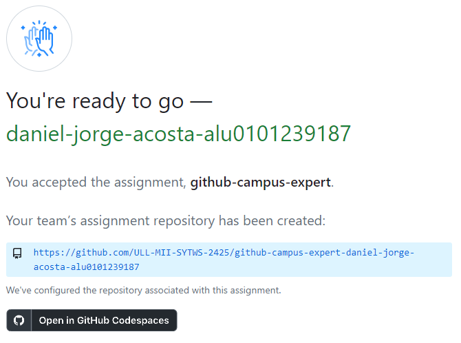
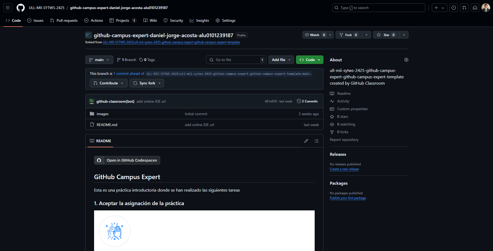
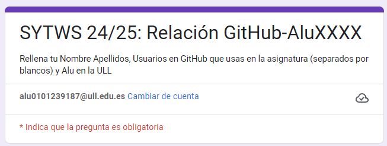
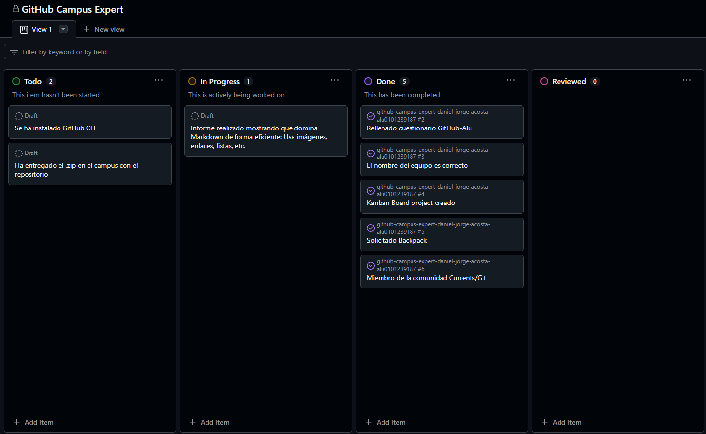
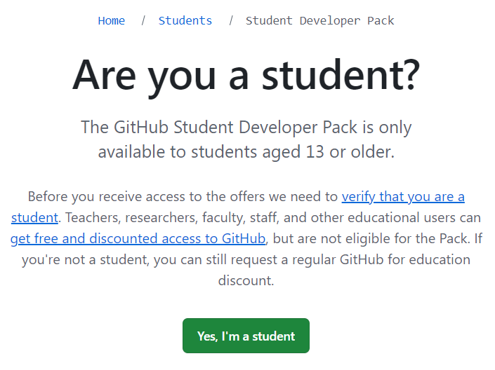
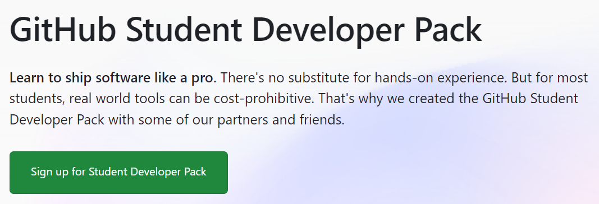
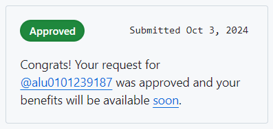
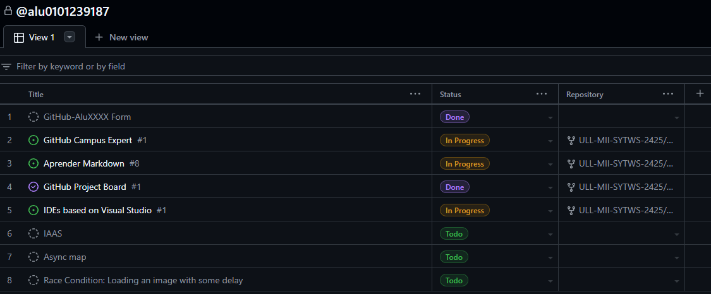
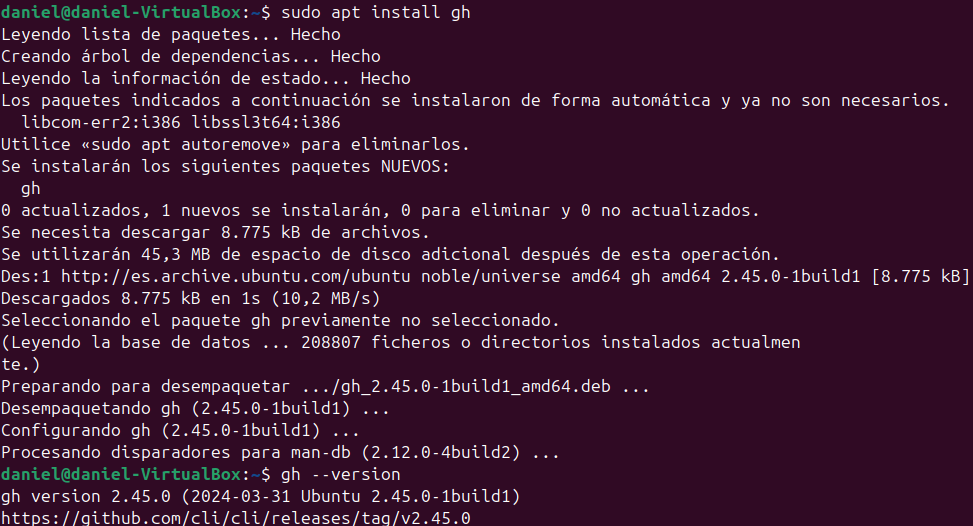

# GitHub Campus Expert
En esta práctica se realizarán varias tareas con el objetivo de mejorar las competencias transversales y establecer el flujo de trabajo habitual en la asignatura.

## Aceptación de la tarea en GitHub Classroom
Para comenzar con la práctica es necesaria la aceptación de la tarea en GitHub Classroom. Para ello es necesaria la previa creación de un equipo individual.

Una vez aceptada la práctica, se genera un repositorio, a partir de la plantilla establecida, en el que podemos comenzar a realizar las tareas solicitadas.

## Rellenar el cuestionario GitHub-Alu
La primera tarea en la práctica ha sido rellenar el cuestionario GitHub-Alu utilizado para indicar nuestra cuenta de GitHub.

## Darse de alta en la comunidad ULL-MII-SYTWS-2425
La siguiente tarea consiste en darse de alta en una comunidad de Google. Sin embargo, el link proporcionado no muestra la comunidad, llevando a la página de _Inicio_ en su lugar.

## Creación del project board kanban
Se procede a la creación de un project board kanban asociada al repositorio, añadiendo los requisitos de la práctica al mismo. En este se irá actualizando el estado de las tareas según se vayan comenzando y completando.

## Realización del curso Become a Campus Expert
Se plantea la realización del curso Become a Campus Expert. Sin embargo, en estos momento es imposible si quiera optar a la inscripción, dado que tras solicitar el Student Developer Pack, las ventajas proporcionadas por este pueden tardar un tiempo en estar activas.

## Solicitar el Student Developer Pack
Esta tarea consiste en solicitar el Student Developer Pack. Para ello, se nos pide enviar una imagen de algún documento identificativo que demuestre nuestro status de estudiante, en este caso la tarjeta de la ULL.

Tras enviar la imagen, nos llegará la resolución indicando si la solicitud ha sido aceptada o rechazada. En este caso ha sido aprobada, aunque como se indica en el apartado anterior, las ventajas proporcionadas por el Student Developer Pack pueden tardar un tiempo en estar activas.

## Solicitar una GitHub Intership
En la siguiente tarea, se nos plantea la posibilidad de solicitar una GitHub Internship. Sin embargo, el link que aparece en la página dedicada a las mismas lleva a la misma página, por lo que probablemente no se encuentren disponibles en estos momentos.

## Realizar la práctica GitHub Project Board
Uno de los últimos pasos de esta práctica consiste en la realización de la práctica GitHub Project Board, que nos guía en la creación de un proyecto en la organización para llevar el seguimiento del avance general en todas las prácticas de la asignatura.

## Instalación de GitHub CLI
Por último, se ha procedido a la instalación de GitHub CLI en el ordenador utilizando el comando `sudo apt install gh`.

## Entrega de la práctica
Para finalizar la práctica, se debe entregar el repositorio en el campus virtual de la asignatura, añadiendo un enlace al mismo y subiendo el archivo *.zip* siempre que sea posible.
